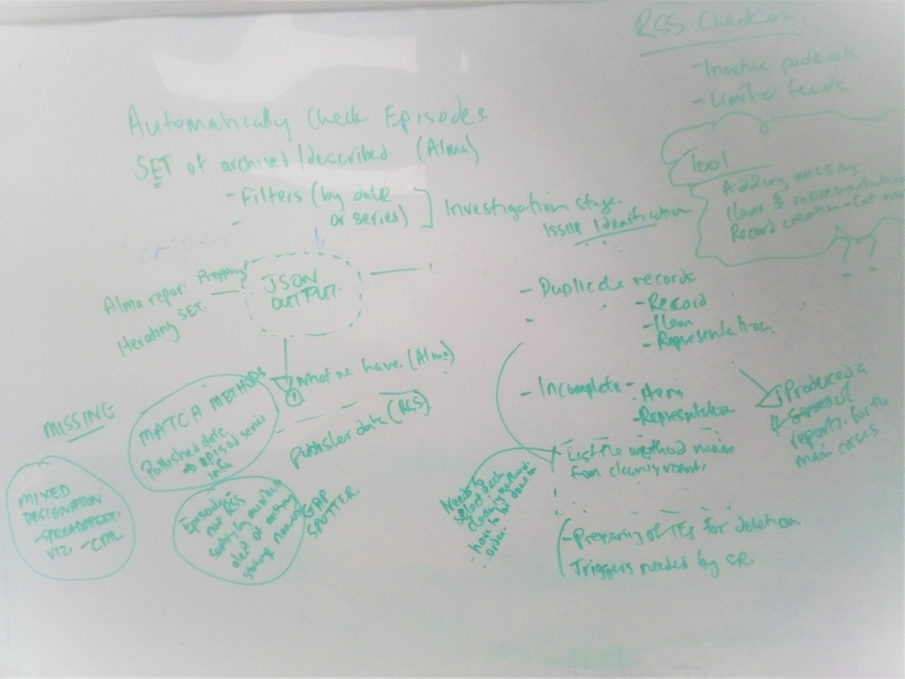

# Podcasts cleaning workflow

## Table of Contents
1. [Worklow description](#workflow-description)
2. [Set and filters](#making-necessary-changes-to-alma-record-creating-rools)
3. [podcasts_cleaning.py script](#podcasts_clesning.py-script)
4. [missing episodes.py script](#missing-episodes)

## Workflow description
***

## set and filters
***
## podcasts_clesning.py script
***
Script is in Tools
### Making json. 
***
Json is the central
### Duplicates and duplicates cleaning 
***
Duplicates
### Incomplete
***
Incomplete

## missing_episodes.py script
***
### rss_checker
### episode checking by number
### spreadsheet

